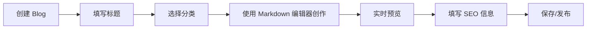
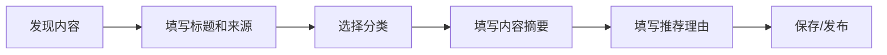

# 内容编辑指南

本指南说明如何编辑不同类型的内容，以及 Blog 和 Weekly 的编辑差异。

---

## 内容类型概述

Weekly 系统支持两种主要内容类型：

| 类型 | ID | 用途 | 格式 | 编辑方式 |
|------|-----|------|------|----------|
| **Blog** | 4 | 长文博客 | Markdown | Markdown 编辑器 |
| **Weekly** | 3 | 周刊推荐 | 结构化 JSON | 表单输入 |

---

## Blog 编辑

### 特点

- 📝 **自由格式**：支持完整的 Markdown 语法
- 📖 **长文创作**：适合 1000+ 字的深度内容
- 🎨 **丰富格式**：代码块、图片、链接、列表、引用等
- 👁️ **实时预览**：边写边看效果

### 编辑界面

```
┌─────────────────────────────────────────────────┐
│  内容编辑 - 支持 Markdown 语法                     │
│  [B] [I] [<>] [H] [🔗] [📷] [•] [1.]  ← 工具栏    │
├─────────────────────────────────────────────────┤
│                                                 │
│  # 标题                                         │
│                                                 │
│  这是一段**粗体**和*斜体*的文本。               │
│                                                 │
│  ```javascript                                  │
│  console.log('Hello World');                    │
│  ```                                            │
│                                                 │
│                             │
│                                                 │
└─────────────────────────────────────────────────┘
```

### 必填字段

- ✅ **标题**：文章标题
- ✅ **内容**：Markdown 正文
- ✅ **分类**：内容分类
- ✅ **状态**：draft/published/archived/hidden

### 可选字段

- 📝 **描述**：文章简介（SEO）
- 🖼️ **封面图片**：文章封面 URL
- 🔍 **SEO 标题**：搜索引擎显示的标题
- 🔍 **SEO 描述**：搜索引擎显示的描述
- ⭐ **精选**：是否标记为精选内容

### 编辑技巧

1. **使用工具栏**：快速插入 Markdown 语法
2. **实时预览**：右侧查看渲染效果
3. **自动保存**：每 3 秒自动保存，防止丢失
4. **快捷键**（计划中）：
   - `Ctrl+B` - 粗体
   - `Ctrl+I` - 斜体
   - `Ctrl+S` - 保存

### 示例内容

```markdown
# 如何优化 React 性能

React 是一个强大的前端框架，但在大型应用中可能会遇到性能问题。本文介绍几个实用的优化技巧。

## 1. 使用 React.memo

`React.memo` 可以避免不必要的重新渲染：

\`\`\`javascript
const MyComponent = React.memo(({ data }) => {
  return <div>{data}</div>;
});
\`\`\`

## 2. 使用 useMemo 和 useCallback

避免每次渲染都创建新的对象和函数...
```

---

## Weekly 编辑

### 特点

- 📋 **结构化**：固定的字段结构
- 🎯 **简洁**：专注于核心推荐信息
- 🔗 **来源清晰**：明确标注来源和链接
- 💡 **推荐导向**：突出为什么推荐

### 编辑界面

```
┌─────────────────────────────────────────────────┐
│  内容编辑 - 结构化内容输入                         │
├─────────────────────────────────────────────────┤
│  内容摘要 *                                      │
│  ┌─────────────────────────────────────────┐   │
│  │ 这是一个强大的 React 性能优化库...      │   │
│  │                                         │   │
│  │ - 支持自动 memo 化                      │   │
│  │ - 减少 90% 不必要渲染                   │   │
│  │ - 零配置，开箱即用                      │   │
│  └─────────────────────────────────────────┘   │
│  💡 提示：Weekly 内容使用结构化存储，建议简洁     │
│     描述核心内容和亮点                           │
└─────────────────────────────────────────────────┘
```

### 必填字段

- ✅ **标题**：推荐内容的标题
- ✅ **内容摘要**：简洁的核心描述（200-500 字）
- ✅ **来源名称**：内容来源（如 GitHub、Medium）
- ✅ **来源链接**：原文 URL
- ✅ **分类**：内容分类
- ✅ **状态**：draft/published/archived/hidden

### 可选字段

- 💡 **推荐理由**：为什么推荐这个内容
- 📸 **截图 API**：自动截图方式（ScreenshotLayer/HCTI/手动上传）
- ⭐ **精选**：是否标记为精选内容

### 内容摘要建议

Weekly 的内容摘要应该：

✅ **简洁明了**
- 2-5 段，每段 1-3 句话
- 总字数 200-500 字

✅ **突出亮点**
- 核心功能或观点
- 独特之处
- 适用场景

✅ **可用简单 Markdown**
- 列表（`- 项目`）
- 粗体（`**重点**`）
- 链接（`[文字](URL)`）

❌ **避免**
- 长篇大论
- 复杂的 Markdown 语法（如表格、代码块）
- 过多格式化

### 示例内容

**标题**: React Auto Memo - 自动优化 React 性能

**内容摘要**:
```
一个零配置的 React 性能优化库，通过自动 memo 化减少不必要的组件重新渲染。

**核心特性**:
- 自动检测并优化组件
- 减少 90% 不必要的渲染
- 完全透明，无需修改现有代码
- 支持 React 18+

**适用场景**:
适合有性能问题的大型 React 应用，特别是列表密集型和频繁更新的场景。
```

**来源**: GitHub  
**来源链接**: `https://github.com/example/react-auto-memo`  
**推荐理由**: 解决了 React 性能优化的痛点，零配置即可使用，效果显著。

---

## 编辑流程对比

### Blog 编辑流程



**特点**：
- 创作为主，编辑器功能丰富
- 适合长时间投入的深度创作

### Weekly 编辑流程



**特点**：
- 整理为主，快速录入
- 适合批量处理推荐内容

---

## 数据存储差异

### Blog

```json
{
  "title": "如何优化 React 性能",
  "content": "# 如何优化 React 性能\n\nReact 是一个...",
  "content_type_id": 4,
  "description": "介绍 React 性能优化的实用技巧",
  "cover_image": "https://...",
  "meta_title": "React 性能优化完全指南",
  "meta_description": "..."
}
```

**特点**：
- `content` 字段存储完整的 Markdown 文本
- 适合自由格式的创作

### Weekly

```json
{
  "title": "React Auto Memo - 自动优化性能",
  "content": "一个零配置的 React 性能优化库...\n\n**核心特性**:\n- 自动检测",
  "content_type_id": 3,
  "source": "GitHub",
  "source_url": "https://github.com/example/react-auto-memo",
  "recommendation_reason": "解决了 React 性能优化的痛点...",
  "screenshot_api": "ScreenshotLayer"
}
```

**特点**：
- `content` 字段存储简洁的摘要（可用简单 Markdown）
- 配合其他结构化字段（source, source_url, recommendation_reason）
- 适合批量管理和展示

---

## 最佳实践

### Blog 最佳实践

1. **结构清晰**
   - 使用标题层级（H1, H2, H3）
   - 段落之间留空行
   - 合理使用列表和引用

2. **代码示例**
   - 使用代码块（```语言名）
   - 添加注释说明
   - 保持代码简洁

3. **图片优化**
   - 使用 CDN 托管图片
   - 添加 alt 描述
   - 控制图片大小

4. **SEO 优化**
   - 填写描述和 SEO 信息
   - 使用关键词
   - 选择合适的分类和标签

### Weekly 最佳实践

1. **标题规范**
   - 清晰描述内容主题
   - 包含关键词
   - 控制在 50 字以内

2. **摘要编写**
   - 第一段总述核心内容
   - 使用列表突出特性
   - 说明适用场景
   - 200-500 字最佳

3. **来源信息**
   - 准确填写来源名称
   - 使用原文 URL（不用短链接）
   - 确保链接可访问

4. **推荐理由**
   - 说明为什么值得推荐
   - 与其他类似内容的差异
   - 适合什么样的读者

---

## 常见问题

### Q: Weekly 可以使用 Markdown 吗？

**A**: 可以，但建议只使用简单的 Markdown 语法：
- ✅ 列表 (`-` 或 `1.`)
- ✅ 粗体 (`**文字**`)
- ✅ 链接 (`[文字](URL)`)
- ❌ 不建议使用代码块、表格等复杂语法

### Q: 为什么 Weekly 不用 Markdown 编辑器？

**A**: 原因如下：
1. **数据结构**：Weekly 是结构化数据，不是自由格式
2. **编辑效率**：简单的文本框更适合快速录入
3. **内容一致性**：避免格式混乱
4. **展示优化**：结构化数据更容易渲染成卡片

### Q: 能把 Blog 转成 Weekly 吗？

**A**: 不建议，因为：
- Blog 和 Weekly 的目的不同
- 数据结构不兼容
- Blog 通常太长，不适合作为推荐

建议为同一主题分别创建 Blog（深度解析）和 Weekly（简要推荐）。

### Q: 老的 Weekly 内容是 Markdown 格式怎么办？

**A**: 系统使用 `ContentFormatAdapter` 自动兼容：
- 老数据：自动识别为 Markdown 格式
- 新数据：使用结构化存储
- 无需手动迁移

---

## 技术细节

### 编辑器实现

```typescript
// simplified-editor.tsx
{contentTypeId === 4 ? (
  // Blog: Markdown 编辑器
  <MDEditor
    value={field.value}
    onChange={(val) => field.onChange(val || '')}
    preview="edit"
    height={500}
  />
) : (
  // Weekly: 结构化输入
  <Textarea
    placeholder="请输入周刊内容的摘要或关键点"
    rows={8}
  />
)}
```

### 格式检测

```typescript
// format-adapter.ts
class ContentFormatAdapter {
  static detectFormat(content: string): ContentFormat {
    try {
      const parsed = JSON.parse(content);
      if (parsed && typeof parsed === 'object') {
        return 'json';
      }
    } catch {
      return 'markdown';
    }
  }
}
```

---

## 相关文档

- [设计决策记录 - ADR-001](./DESIGN_DECISIONS.md#adr-001-内容编辑器根据类型差异化)
- [技术架构文档](./TECHNICAL_ARCHITECTURE.md)
- [重构进度报告](./REFACTOR_PROGRESS.md)

---

> **维护说明**：  
> 本文档随着产品迭代会持续更新，请参考最新版本。
