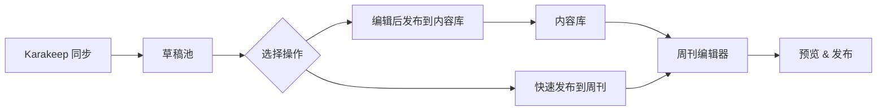

# Weekly 内容管理系统 - 重构与优化 PRD

**版本**: v2.0  
**创建日期**: 2025年1月  
**最后更新**: 2025年11月  
**状态**: 🚧 进行中

---

## 📋 目录

1. [项目概述](#项目概述)
2. [重构目标](#重构目标)
3. [用户角色分析](#用户角色分析)
4. [核心问题分析](#核心问题分析)
5. [解决方案](#解决方案)
6. [功能模块设计](#功能模块设计)
7. [技术架构升级](#技术架构升级)
8. [数据模型优化](#数据模型优化)
9. [实施计划](#实施计划)

---

## 1. 项目概述

### 1.1 产品定位

专业的周刊内容管理系统,为内容创作者提供高效、简洁的内容聚合、编辑和发布工具。

### 1.2 当前技术栈

- **前端**: Next.js 15 + React 19 + TypeScript
- **UI库**: Ant Design + ProComponents
- **状态管理**: Zustand
- **数据请求**: TanStack React Query + Ky
- **后端**: Next.js API Routes
- **数据库**: MySQL + Prisma ORM
- **搜索**: MeiliSearch
- **认证**: 自定义 JWT

### 1.3 当前主要功能

- ✅ 内容管理 (Blog/Weekly 两种类型)
- ✅ 草稿管理 (从 Karakeep 同步书签)
- ✅ 周刊管理 (期号、内容组织、发布)
- ✅ 全文搜索 (MeiliSearch)
- ✅ 分析统计
- ✅ 操作日志
- ✅ 用户管理

---

## 2. 重构目标

### 2.1 用户体验优化

#### 高优先级
1. **简化工作流** - 减少周刊发布的步骤和复杂度
2. **优化 UI** - 采用现代化、美观的设计系统
3. **提升性能** - 页面加载更快,交互更流畅

#### 中优先级
4. **数据格式适配** - 支持 MD 字符串和结构化数据的混合场景
5. **优化分析功能** - 聚焦内容相关的核心指标
6. **简化操作记录** - 记录真正有用的操作日志

### 2.2 技术债务清理

1. **UI 库迁移**: Ant Design → shadcn/ui (tweakcn claude theme)
2. **数据格式统一**: 处理历史 MD 格式和新的结构化格式
3. **操作日志修复**: 确保正确记录所有关键操作
4. **代码简化**: 移除不必要的复杂度

---

## 3. 用户角色分析

### 3.1 主要用户: 内容创作者/编辑

**目标**: 高效发布周刊内容

**核心需求**:
- 快速从草稿筛选优质内容
- 便捷的内容编辑和预览
- 简单直观的周刊组织流程
- 清晰的内容状态管理

**痛点**:
- ❌ 当前流程太复杂: 同步草稿 → 草稿列表 → 正文草稿 → 正文编辑 → 周刊管理
- ❌ 编辑页面功能过于复杂,学习成本高
- ❌ 预览与实际发布效果不一致
- ❌ 历史内容(MD 格式)和新内容(结构化)编辑方式不统一

**期望**:
- ✅ 一站式内容管理界面
- ✅ 直观的可视化编辑
- ✅ 所见即所得的预览
- ✅ 统一的内容编辑体验

---

## 4. 核心问题分析

### 4.1 问题 1: UI 库性能与定制性

**现状**: Ant Design + ProComponents
- 体积较大,加载慢
- 定制化困难
- 设计风格相对传统

**改进方案**: 迁移到 shadcn/ui
- 按需引入,打包体积小
- 基于 Radix UI,可访问性好
- 完全可定制,使用 tweakcn claude theme
- 现代化设计风格

### 4.2 问题 2: 操作日志记录不准确

**现状分析**:
```typescript
// 当前问题:
// 1. resource_id 类型不匹配 (定义为 Int,但 content_id 是 BigInt)
// 2. 某些操作未正确记录
// 3. 缺少关键上下文信息
```

**改进方案**:
1. 修复 `resource_id` 类型问题
2. 统一操作日志记录点
3. 增加更多上下文信息(操作前后的状态对比)
4. 简化日志查询界面

### 4.3 问题 3: 周刊发布流程过于复杂

**当前流程**:
```
1. 从 Karakeep 同步草稿到数据库
2. 进入草稿列表筛选和确认
3. 将草稿转为正文草稿
4. 正文编辑确认
5. 在周刊管理中添加内容
6. 组织周刊结构
7. 预览和发布
```

**问题分析**:
- 步骤过多,容易迷失
- "草稿" vs "正文草稿" 概念混乱
- 重复的确认和编辑步骤

**优化方案**:
```
简化为 3 步:
1. 草稿管理: 同步、筛选、快速预览
2. 内容编辑: 直接编辑并发布为内容(optional)
3. 周刊组织: 选择内容、排序、预览、发布
```

### 4.4 问题 4: 内容格式不统一

**历史遗留问题**:
```javascript
// 早期: MD 文件保存
// 中期: 迁移到数据库,但还是 MD 格式的字符串
// 现在: 新内容全是结构化键值对

// 示例 - 老数据:
content: "## 标题\n\n内容..."

// 示例 - 新数据:
content: '{"title": "...", "description": "...", "sections": [...]}'
```

**改进方案**:
1. 识别内容格式(MD 字符串 vs JSON)
2. 统一渲染逻辑
3. 提供格式转换工具
4. 编辑器支持两种格式

### 4.5 问题 5: 分析功能过于复杂

**当前问题**:
- 包含了访问/点击统计(实际由 umami 处理)
- 图表过多,重点不突出
- 对周刊运营价值不大的指标占据大量空间

**改进方案**:
聚焦内容创作相关指标:
- 内容发布频率
- 内容来源分布
- 分类/标签使用情况
- 草稿转化率
- 周刊完成度趋势

---

## 5. 解决方案

### 5.1 UI 库迁移计划

#### 阶段 1: 基础设施搭建
- [ ] 安装 shadcn/ui 和 tweakcn
- [ ] 配置 claude theme
- [ ] 创建设计系统文档
- [ ] 搭建组件 Storybook(可选)

#### 阶段 2: 核心组件迁移
优先级排序:
1. **登录页** (独立页面,影响范围小)
2. **内容编辑页** (核心功能)
3. **内容预览页** (核心功能)
4. **仪表板** (首页)
5. 其他页面

#### 阶段 3: 细节优化
- 动画效果
- 响应式适配
- 深色模式支持
- 可访问性优化

### 5.2 工作流简化方案

#### 新的周刊发布流程



**核心改进**:
1. **草稿池**: 一站式查看所有同步的草稿
   - 快速预览
   - 批量操作
   - 智能分类建议
   - 一键发布到周刊

2. **灵活发布**:
   - 选项 A: 草稿 → 直接加入周刊(无需转为正式内容)
   - 选项 B: 草稿 → 编辑为正式内容 → 加入周刊

3. **周刊编辑器**:
   - 左侧: 可用内容列表(内容库 + 本期临时草稿)
   - 中间: 当前周刊结构(拖拽排序)
   - 右侧: 实时预览

### 5.3 路由结构重新设计

#### 当前路由结构
```
/dashboard - 仪表板
/content/list - 内容列表
/content/editor/[id] - 内容编辑
/content/drafts - 草稿列表
/weekly - 周刊列表
/weekly/[id] - 周刊编辑
/weekly/preview/[id] - 周刊预览
/analytics - 分析
/operation-logs - 操作日志
/search - 搜索
```

#### 优化后路由结构
```
/ (或 /dashboard) - 仪表板
  ├─ 快速操作卡片
  ├─ 最近编辑的内容
  ├─ 待处理草稿数量
  └─ 核心数据概览

/drafts - 草稿管理 (简化)
  ├─ 同步按钮
  ├─ 草稿列表(卡片视图)
  ├─ 快速预览 Modal
  ├─ 批量操作
  └─ 快速发布到周刊

/content - 内容库 (简化)
  ├─ 列表视图(支持筛选)
  ├─ /content/new - 新建内容
  └─ /content/[id] - 编辑内容(包含预览)

/weekly - 周刊管理 (简化)
  ├─ 期号列表
  ├─ /weekly/new - 创建新周刊
  ├─ /weekly/[id]/edit - 编辑周刊(三栏布局)
  └─ /weekly/[id]/preview - 预览分享页

/insights - 内容洞察 (替代原分析页)
  └─ 聚焦内容相关指标

/settings - 设置
  ├─ /settings/profile - 个人设置
  ├─ /settings/tags - 标签管理
  ├─ /settings/categories - 分类管理
  └─ /settings/logs - 操作日志
```

---

## 6. 功能模块设计

### 6.1 登录页 (优先级: 🔴 最高)

**设计要点**:
- 极简设计,焦点在表单
- 使用 claude theme 的渐变和阴影
- 品牌色突出
- 响应式设计
- 微交互动画

**技术实现**:
- shadcn/ui `Card`, `Input`, `Button`
- Framer Motion 动画
- Tailwind CSS 渐变背景

### 6.2 草稿管理 (优先级: 🔴 最高)

**核心功能**:
1. **同步草稿**
   - 一键从 Karakeep 同步
   - 显示同步进度
   - 自动去重

2. **草稿列表**
   - 卡片视图(默认)
   - 显示: 标题、来源、摘要、标签、时间
   - 筛选: 状态、来源、标签
   - 排序: 时间、优先级

3. **快速操作**
   - 点击卡片 → 快速预览 Modal
   - 操作按钮:
     - "加入周刊" → 直接加入当前编辑的周刊
     - "编辑发布" → 跳转到内容编辑页
     - "忽略" → 标记为 rejected
   - 批量操作: 批量加入周刊、批量忽略

### 6.3 内容编辑 (优先级: 🔴 最高)

**设计目标**: 简洁、高效、统一

**编辑器特性**:
- 分屏布局: 左侧编辑,右侧实时预览
- 支持 Markdown 和富文本混合编辑
- 自动保存(每 30 秒)
- 版本历史

**数据格式兼容**:
```typescript
// 识别内容格式
function detectContentFormat(content: string): 'markdown' | 'json' {
  try {
    JSON.parse(content);
    return 'json';
  } catch {
    return 'markdown';
  }
}

// 统一渲染
function renderContent(content: string) {
  const format = detectContentFormat(content);
  if (format === 'json') {
    return <StructuredRenderer data={JSON.parse(content)} />;
  }
  return <MarkdownRenderer markdown={content} />;
}
```

### 6.4 周刊编辑 (优先级: 🟡 高)

**三栏布局**:

```
┌─────────────────────────────────────────────────────┐
│ 周刊编辑器 - 第 42 期                   [预览][发布]│
├────────────┬──────────────────┬─────────────────────┤
│            │                  │                     │
│  内容池    │   当前周刊结构    │   实时预览          │
│            │                  │                     │
│ [搜索]     │ # 本期推荐       │   [完整预览]        │
│            │ ├ 内容 1 [×]     │                     │
│ 📁 技术    │ ├ 内容 2 [×]     │   渲染的周刊        │
│  - 内容 A  │ └ 内容 3 [×]     │   内容...           │
│  - 内容 B  │                  │                     │
│            │ # 工具推荐       │                     │
│ 📁 设计    │ ├ 内容 4 [×]     │                     │
│  - 内容 C  │                  │                     │
│            │ [添加分组]       │                     │
│ 📁 草稿池  │                  │                     │
│  - 草稿 X  │                  │                     │
│  - 草稿 Y  │                  │                     │
│            │                  │                     │
└────────────┴──────────────────┴─────────────────────┘
```

**交互细节**:
- 拖拽添加: 从左侧内容池拖到中间区域
- 拖拽排序: 在中间区域内拖拽调整顺序
- 分组管理: 动态添加/删除分组
- 实时预览: 中间区域任何改动立即反映到右侧

### 6.5 内容预览 (优先级: 🔴 最高)

**统一渲染逻辑**:
```typescript
interface ContentPreviewProps {
  content: string;
  contentFormat?: 'markdown' | 'mdx' | 'json';
  metadata?: {
    title: string;
    source?: string;
    sourceUrl?: string;
    imageUrl?: string;
    tags?: string[];
  };
}

// 自动检测并渲染
function ContentPreview({ content, contentFormat, metadata }: ContentPreviewProps) {
  const format = contentFormat || detectContentFormat(content);
  
  return (
    <div className="preview-container">
      <PreviewHeader metadata={metadata} />
      {format === 'json' ? (
        <StructuredContentRenderer data={JSON.parse(content)} />
      ) : (
        <MarkdownRenderer markdown={content} />
      )}
    </div>
  );
}
```

### 6.6 仪表板 (优先级: 🟡 高)

**设计原则**: 简洁、信息密度适中、可操作

**核心组件**:
1. **快速操作卡片**
   - 创建新周刊
   - 查看待处理草稿
   - 编辑最近的周刊

2. **数据概览**
   - 本周发布的内容数
   - 待处理草稿数
   - 本月周刊发布数
   - 内容库总量

3. **最近编辑**
   - 最近 5 条编辑的内容
   - 快速跳转

4. **待办事项**
   - 待确认的草稿
   - 待发布的周刊

### 6.7 内容洞察 (优先级: 🟢 中)

**聚焦的核心指标**:

#### 内容创作健康度
- 📊 内容发布频率趋势(周/月)
- 📊 草稿转化率
- 📊 草稿积压情况

#### 内容来源分析
- 📊 Top 10 内容来源
- 📊 来源多样性指数
- 📊 新增来源趋势

#### 分类和标签
- 📊 最常用的分类 Top 5
- 📊 最常用的标签 Top 10
- 📊 标签使用趋势

#### 周刊完成度
- 📊 每期周刊的内容数量
- 📊 平均准备时间
- 📊 发布准时率

**移除的指标** (已有 umami 统计):
- ❌ 页面浏览量
- ❌ 内容点击率
- ❌ 用户访问路径

---

## 7. 技术架构升级

### 7.1 UI 库迁移

#### 依赖安装
```bash
# shadcn/ui 及依赖
pnpm add @radix-ui/react-dialog @radix-ui/react-dropdown-menu
pnpm add @radix-ui/react-slot @radix-ui/react-toast
pnpm add class-variance-authority clsx tailwind-merge
pnpm add lucide-react

# tweakcn (如果有独立包)
pnpm add tweakcn

# 开发依赖
pnpm add -D @types/node
```

#### 配置 shadcn/ui
```bash
npx shadcn@latest init
```

选择 claude theme:
```json
{
  "style": "default",
  "rsc": false,
  "tsx": true,
  "tailwind": {
    "config": "tailwind.config.ts",
    "css": "src/app/globals.css",
    "baseColor": "slate",
    "cssVariables": true
  },
  "aliases": {
    "components": "@/components",
    "utils": "@/lib/utils"
  }
}
```

### 7.2 操作日志修复

#### Schema 修改
```prisma
model operation_logs {
  id                Int                           @id @default(autoincrement())
  user_id           Int
  operation_type    operation_logs_operation_type
  resource_type     String                        @db.VarChar(50)
  resource_id       String?                       @db.VarChar(50) // 改为 String,支持 BigInt
  operation_details String?                       @db.Text
  ip_address        String?                       @db.VarChar(45)
  user_agent        String?                       @db.Text
  created_at        DateTime?                     @default(now()) @db.Timestamp(0)

  // Relations
  user users @relation(fields: [user_id], references: [id])

  @@index([operation_type], map: "idx_operation_type")
  @@index([resource_type], map: "idx_resource_type")
  @@index([user_id], map: "idx_user_id")
}
```

#### 统一日志记录点
- API Route 统一在 try-catch finally 块中记录
- 使用 middleware 自动记录重要操作
- 前端操作不直接记录,由后端 API 记录

### 7.3 数据格式兼容层

```typescript
// src/lib/content/format-adapter.ts

export type ContentFormat = 'markdown' | 'json';

export interface StructuredContent {
  title: string;
  description?: string;
  sections: Array<{
    heading?: string;
    content: string;
    type?: 'text' | 'code' | 'image' | 'quote';
  }>;
  metadata?: Record<string, any>;
}

export class ContentFormatAdapter {
  // 检测内容格式
  static detectFormat(content: string): ContentFormat {
    if (!content || content.trim().length === 0) return 'markdown';
    
    try {
      const parsed = JSON.parse(content);
      if (parsed && typeof parsed === 'object') {
        return 'json';
      }
    } catch {
      // not JSON
    }
    
    return 'markdown';
  }

  // 统一转换为结构化格式
  static toStructured(content: string): StructuredContent {
    const format = this.detectFormat(content);
    
    if (format === 'json') {
      return JSON.parse(content);
    }
    
    // Markdown 转结构化
    return this.markdownToStructured(content);
  }

  // Markdown 转结构化
  private static markdownToStructured(markdown: string): StructuredContent {
    // 简单的解析逻辑,可以用 remark 等库优化
    const lines = markdown.split('\n');
    const sections: StructuredContent['sections'] = [];
    let currentSection: { heading?: string; content: string } = { content: '' };

    for (const line of lines) {
      if (line.startsWith('## ')) {
        if (currentSection.content.trim()) {
          sections.push({ ...currentSection });
        }
        currentSection = { heading: line.replace('## ', ''), content: '' };
      } else {
        currentSection.content += line + '\n';
      }
    }

    if (currentSection.content.trim()) {
      sections.push(currentSection);
    }

    return {
      title: sections[0]?.heading || '',
      sections: sections.slice(1)
    };
  }

  // 结构化转 Markdown
  static toMarkdown(structured: StructuredContent): string {
    let markdown = '';

    if (structured.title) {
      markdown += `# ${structured.title}\n\n`;
    }

    for (const section of structured.sections) {
      if (section.heading) {
        markdown += `## ${section.heading}\n\n`;
      }
      markdown += section.content + '\n\n';
    }

    return markdown.trim();
  }
}
```

---

## 8. 数据模型优化

### 8.1 操作日志表修改

```sql
-- 修改 resource_id 类型
ALTER TABLE operation_logs MODIFY COLUMN resource_id VARCHAR(50);

-- 添加索引
ALTER TABLE operation_logs ADD INDEX idx_resource_id (resource_id);
```

### 8.2 内容表优化 (可选)

考虑添加 `content_json` 字段,存储结构化数据:

```prisma
model contents {
  // ... 现有字段
  content        String                   @db.LongText // 保留 Markdown
  content_json   String?                  @db.LongText // 新增 JSON 字段
  // ...
}
```

迁移策略:
- 新内容: 同时存储 Markdown 和 JSON
- 老内容: 按需转换,或保持 Markdown 格式

---

## 9. 实施计划

### 阶段 1: 基础设施和关键页面 (1-2 周)

**目标**: 搭建新 UI 系统,完成核心页面迁移

#### 任务列表
- [x] T1.1: 安装和配置 shadcn/ui + claude theme
- [x] T1.2: 创建设计系统文档(颜色、字体、间距等)
- [x] T1.3: 迁移登录页到 shadcn/ui
- [x] T1.4: 修复操作日志 schema 和 service
- [x] T1.5: 创建内容格式适配器 (ContentFormatAdapter)
- [x] T1.6: 优化内容编辑页(支持新老格式)
- [x] T1.7: 优化内容预览页(统一渲染逻辑)

### 阶段 2: 工作流简化 (1-2 周)

**目标**: 简化草稿和周刊管理流程

#### 任务列表
- [x] T2.1: 重新设计草稿管理页面
  - [x] 卡片视图
  - [x] 快速预览 Modal
  - [x] 批量操作
  - [x] 一键加入周刊
- [x] T2.2: 简化周刊编辑器
  - [x] 三栏布局
  - [x] 拖拽交互
  - [x] 实时预览
- [ ] T2.3: 优化路由结构
- [ ] T2.4: 数据流优化(减少不必要的 API 调用)

### 阶段 3: 仪表板和分析 (1 周)

**目标**: 优化首页和分析功能

#### 任务列表
- [ ] T3.1: 重新设计仪表板
  - [ ] 快速操作卡片
  - [ ] 数据概览
  - [ ] 最近编辑
  - [ ] 待办事项
- [ ] T3.2: 重新设计内容洞察页
  - [ ] 移除访问/点击统计
  - [ ] 聚焦内容相关指标
  - [ ] 优化图表展示

### 阶段 4: 其他页面和细节优化 (1 周)

**目标**: 完成剩余页面迁移,细节优化

#### 任务列表
- [ ] T4.1: 迁移设置页面
- [ ] T4.2: 迁移操作日志页面
- [ ] T4.3: 迁移搜索页面
- [ ] T4.4: 响应式适配
- [ ] T4.5: 动画和微交互
- [ ] T4.6: 深色模式支持(可选)
- [ ] T4.7: 可访问性优化

### 阶段 5: 测试和文档 (0.5-1 周)

**目标**: 全面测试,完善文档

#### 任务列表
- [ ] T5.1: 功能测试
- [ ] T5.2: UI/UX 测试
- [ ] T5.3: 性能测试
- [ ] T5.4: 更新用户文档
- [ ] T5.5: 更新开发文档
- [ ] T5.6: 部署和上线

---

## 10. 成功标准

### 用户体验
- ✅ 周刊发布流程从 7 步减少到 3 步
- ✅ 页面加载时间减少 30%
- ✅ 用户操作减少 40%
- ✅ UI 现代化,符合 2024 年设计趋势

### 技术指标
- ✅ 打包体积减少 20%
- ✅ 代码可维护性提升(组件化、模块化)
- ✅ 操作日志记录准确率 100%
- ✅ 新老内容格式完美兼容

### 内容管理
- ✅ 草稿处理效率提升 50%
- ✅ 内容编辑体验统一
- ✅ 预览与实际发布一致性 100%

---

## 11. 风险和挑战

### 技术风险
1. **UI 库迁移复杂度**: 大量页面需要重写
   - 缓解: 逐步迁移,保持老代码可用
   
2. **数据格式兼容性**: 老数据可能无法完美转换
   - 缓解: 保留原始数据,提供手动修正工具

3. **操作日志 schema 变更**: 可能影响现有数据
   - 缓解: 谨慎迁移,备份数据

### 业务风险
1. **用户习惯改变**: 用户需要重新学习
   - 缓解: 提供迁移指南,保持核心流程相似

2. **功能回归**: 迁移过程中可能遗漏功能
   - 缓解: 详细的功能清单,逐项检查

---

## 12. 后续计划

### 短期 (3 个月内)
- 根据用户反馈持续优化 UI
- 完善内容格式转换工具
- 增加更多自动化功能

### 中期 (6 个月内)
- AI 辅助内容推荐
- 自动分类和标签建议
- 智能排版优化

### 长期 (1 年内)
- 多人协作功能
- 版本控制和审批流程
- 插件系统,支持自定义扩展

---

## 附录

### A. 参考资料
- [shadcn/ui 官方文档](https://ui.shadcn.com/)
- [Radix UI 文档](https://www.radix-ui.com/)
- [tweakcn 文档](https://tweakcn.dev/)
- [Ant Design 迁移指南](https://ant.design/)

### B. 相关文档
- [技术架构文档](./TECHNICAL_ARCHITECTURE.md)
- [任务清单](./TASKS.md)
- [已完成任务](./COMPLETED_TASKS.md)
- [迁移指南](./MIGRATION_GUIDE.md)

---

**文档维护**: 所有 Agent 在完成任务后必须更新相关文档,确保信息同步。
