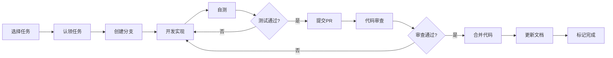

# Weekly 系统重构 - 文档中心

**版本**: v2.0  
**最后更新**: 2025年1月  

---

## 📚 文档导航

### 核心文档

1. **[MAIN_PRD.md](./MAIN_PRD.md)** - 产品需求文档
   - 项目概述
   - 重构目标
   - 核心问题分析
   - 解决方案
   - 功能模块设计
   - 实施计划

2. **[TECHNICAL_ARCHITECTURE.md](./TECHNICAL_ARCHITECTURE.md)** - 技术架构文档
   - 技术栈说明
   - UI 库迁移策略
   - 数据兼容层
   - 操作日志修复
   - 构建与性能优化

3. **[TASKS.md](./TASKS.md)** - 任务清单
   - 详细任务分解
   - 任务优先级
   - 工时估算
   - 任务依赖关系
   - 进度追踪

4. **[COMPLETED_TASKS.md](./COMPLETED_TASKS.md)** - 已完成任务记录
   - 完成日期
   - 负责人
   - 关联 PR
   - 完成说明

5. **[MIGRATION_GUIDE.md](./MIGRATION_GUIDE.md)** - 迁移指南
   - 环境准备
   - UI 组件迁移
   - 数据库迁移
   - 路由调整
   - 测试验证
   - 上线部署
   - 常见问题

6. **[DESIGN_SYSTEM.md](./DESIGN_SYSTEM.md)** - 设计系统
   - 色彩系统
   - 排版规范
   - 间距体系
   - 组件规范
   - 动效规范
   - 可访问性

7. **[DESIGN_DECISIONS.md](./DESIGN_DECISIONS.md)** - 设计决策记录 🆕
   - 架构决策记录 (ADR)
   - 技术选型理由
   - 权衡和影响分析

8. **[CONTENT_EDITING_GUIDE.md](./CONTENT_EDITING_GUIDE.md)** - 内容编辑指南 🆕
   - Blog vs Weekly 编辑差异
   - 编辑最佳实践
   - 常见问题解答

---

## 🚀 快速开始

### 如果你是新加入的开发者

1. **阅读顺序**:
   - 先读 [MAIN_PRD.md](./MAIN_PRD.md) 了解项目背景和目标
   - 再读 [TECHNICAL_ARCHITECTURE.md](./TECHNICAL_ARCHITECTURE.md) 理解技术实现
   - 查看 [TASKS.md](./TASKS.md) 选择你要参与的任务
   - 参考 [MIGRATION_GUIDE.md](./MIGRATION_GUIDE.md) 了解迁移步骤
   - 遵循 [DESIGN_SYSTEM.md](./DESIGN_SYSTEM.md) 的设计规范

2. **环境搭建**:
   ```bash
   # 克隆项目
   git clone <repo-url>
   cd weekly-system
   
   # 切换到开发分支
   git checkout feat-shadcn-claude-migrate-simplify-weekly-fix-oplog-prd-docs-data-adapt
   
   # 安装依赖
   pnpm install
   
   # 配置环境变量
   cp .env.example .env.local
   # 编辑 .env.local
   
   # 启动开发服务器
   pnpm dev
   ```

3. **开始开发**:
   - 在 [TASKS.md](./TASKS.md) 中认领任务
   - 创建功能分支: `git checkout -b task/T1.3-login-page`
   - 开发和测试
   - 提交代码,创建 PR
   - 更新 [COMPLETED_TASKS.md](./COMPLETED_TASKS.md)

### 如果你是产品经理/设计师

- 关注 [MAIN_PRD.md](./MAIN_PRD.md) 的功能模块设计
- 参考 [DESIGN_SYSTEM.md](./DESIGN_SYSTEM.md) 进行设计
- 在 [TASKS.md](./TASKS.md) 中查看开发进度

### 如果你是项目管理者

- 通过 [TASKS.md](./TASKS.md) 追踪项目进度
- 检查 [COMPLETED_TASKS.md](./COMPLETED_TASKS.md) 了解已完成工作
- 评估 [MAIN_PRD.md](./MAIN_PRD.md) 中的风险和挑战

---

## 📋 任务流程



---

## 📊 项目进度概览

### 整体进度

- **总任务数**: 33+ 主任务
- **已完成**: 5
- **进行中**: 0
- **未开始**: 28

### 阶段进度

| 阶段 | 进度 | 状态 |
|------|------|------|
| 阶段 1: 基础设施和关键页面 | 5/7 (71%) | 🔵 进行中 |
| 阶段 2: 工作流简化 | 0/11 | ⚪️ 未开始 |
| 阶段 3: 仪表板和分析 | 0/2 | ⚪️ 未开始 |
| 阶段 4: 其他页面和细节优化 | 0/7 | ⚪️ 未开始 |
| 阶段 5: 测试和文档 | 0/6 | ⚪️ 未开始 |

详见 [TASKS.md](./TASKS.md)

---

## 🎯 核心目标

1. **UI 库迁移**: Ant Design → shadcn/ui + claude theme
2. **简化工作流**: 周刊发布从 7 步减少到 3 步
3. **修复操作日志**: 确保所有操作正确记录
4. **数据格式兼容**: 支持 Markdown 和 JSON 两种格式
5. **优化用户体验**: 更快、更美观、更易用

---

## 🔗 相关链接

- [shadcn/ui 官方文档](https://ui.shadcn.com/)
- [Radix UI 文档](https://www.radix-ui.com/)
- [tweakcn 文档](https://tweakcn.dev/)
- [React Hook Form](https://react-hook-form.com/)
- [Prisma 文档](https://www.prisma.io/docs/)

---

## ❓ 常见问题

### Q: 如何认领任务?

A: 在 [TASKS.md](./TASKS.md) 中找到未开始的任务,在团队群里或 PR 中声明认领。

### Q: 任务估算的工时准确吗?

A: 工时仅供参考,实际可能有偏差。请根据自己的经验调整。

### Q: 可以跳过某些任务吗?

A: 注意任务依赖关系,有些任务需要先完成依赖任务。

### Q: 文档需要同步更新吗?

A: **必须!** 完成任务后请立即更新 [COMPLETED_TASKS.md](./COMPLETED_TASKS.md) 和相关文档。

### Q: 遇到技术问题怎么办?

A: 先查阅 [MIGRATION_GUIDE.md](./MIGRATION_GUIDE.md) 的常见问题,如果没有解决方案,在团队群里讨论。

---

## 📞 联系方式

- **技术问题**: @前端团队
- **产品问题**: @产品经理
- **设计问题**: @设计团队

---

## 📝 文档维护

- 所有文档遵循 Markdown 格式
- 文档更新后需提交到 Git
- 每周 review 一次文档完整性
- 文档维护人: 项目负责人

---

> 本文档体系由 AI Agent 创建,持续维护中。如有疑问或建议,请提交 Issue。
