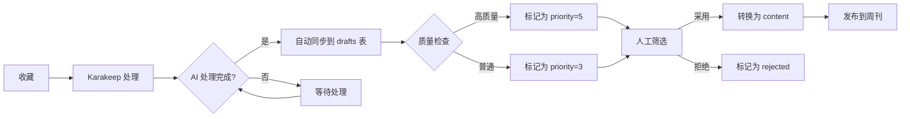

# 草稿管理优化方案

## 📋 问题总结

### 1. ✅ 已实现：补充 Karakeep 字段

**新增字段**：
- `summary` - Karakeep AI 总结
- `tagging_status` - 标注状态（success/pending/failed）
- `summarization_status` - 总结状态（success/pending/failed）
- `slug` - URL 友好标识符
- `content` - 周刊格式化内容
- `source` - 来源网站名
- `word_count` - 字数统计

### 2. ✅ 已实现：AI 处理完成过滤

**同步逻辑**：
- 只同步 `taggingStatus === 'success'` 且 `summarizationStatus === 'success'` 的书签
- 未完成处理的书签会被跳过并记录日志
- 下次同步时会重新检查这些书签

### 3. 🔄 标签关联方案

#### 方案 A：转换时智能匹配（推荐）

在将草稿转换为正式内容时：

1. **精确匹配**：Karakeep 标签名与系统标签名完全相同
   ```typescript
   // 查找系统中已存在的标签
   const existingTag = await prisma.tags.findFirst({
     where: { name: karakeepTagName }
   });
   ```

2. **模糊匹配**：处理相似标签（可选）
   ```typescript
   // 例如：'JavaScript' vs 'javascript' vs 'JS'
   const similarTag = await findSimilarTag(karakeepTagName);
   ```

3. **自动创建**：不存在时创建新标签
   ```typescript
   const newTag = await prisma.tags.create({
     data: {
       name: karakeepTagName,
       slug: generateSlug(karakeepTagName),
     }
   });
   ```

#### 方案 B：预定义映射表

创建 Karakeep 标签到系统标签的映射：

```typescript
const TAG_MAPPING: Record<string, string> = {
  // Karakeep 标签 -> 系统标签
  '前端开发': 'Frontend',
  'AI工具': 'AI',
  '开源项目': 'OpenSource',
  // ...更多映射
};
```

**优点**：
- 统一标签体系
- 避免标签重复
- 便于管理

**缺点**：
- 需要手动维护
- 新标签需要人工添加映射

### 4. 📊 工作流优化建议

#### 当前流程对比

**旧流程（N8N）**：
```
收藏 → N8N 自动处理 → 入库（status=draft）
         ├─ 网页截图
         ├─ AI 总结
         └─ 数据清洗
```

**新流程（Karakeep）**：
```
收藏 → Karakeep AI 处理 → 手动/定时同步 → drafts 表（status=pending）
         ├─ AI 标注
         ├─ AI 总结
         └─ 智能分类
```

#### 🎯 推荐优化方案

**混合流程**：将两个流程整合，充分利用各自优势



**关键改进**：

1. **自动化同步**：
   ```typescript
   // 每小时自动同步
   cron.schedule('0 * * * *', async () => {
     await DraftService.syncFromKarakeep();
   });
   ```

2. **智能优先级**：
   ```typescript
   // 根据 Karakeep 数据质量自动分配优先级
   function calculatePriority(bookmark: KarakeepBookmark): number {
     let priority = 3; // 基础优先级
     
     // AI 总结质量好
     if (bookmark.summary && bookmark.summary.length > 100) priority++;
     
     // 有人工笔记
     if (bookmark.note) priority++;
     
     // 标签丰富
     if (bookmark.tags && bookmark.tags.length >= 3) priority++;
     
     // 被收藏（favourited）
     if (bookmark.favourited) priority += 2;
     
     return Math.min(priority, 5); // 最高 5 星
   }
   ```

3. **质量过滤**：
   ```typescript
   // 只同步满足条件的书签
   const shouldSync = (bookmark: KarakeepBookmark): boolean => {
     return (
       bookmark.taggingStatus === 'success' &&
       bookmark.summarizationStatus === 'success' &&
       !bookmark.archived && // 未归档
       (bookmark.summary || bookmark.content?.description) // 有内容
     );
   };
   ```

4. **统一状态管理**：
   
   **建议保留 contents.status = 'draft'**，但语义不同：
   
   - `drafts.status = 'pending'` - 待审核的收藏
   - `contents.status = 'draft'` - 已采用但未发布的内容
   - `contents.status = 'published'` - 已发布的内容
   
   **转换逻辑**：
   ```typescript
   // 草稿转换为内容时
   const content = await prisma.contents.create({
     data: {
       ...draftData,
       status: 'draft', // 转换后仍需编辑
     }
   });
   
   // 更新草稿状态
   await prisma.drafts.update({
     where: { id: draftId },
     data: { 
       status: 'adopted',
       content_id: content.id,
     }
   });
   ```

### 5. 🔄 数据库迁移

运行以下命令应用新的字段：

```bash
# 1. 推送 schema 到数据库
pnpm prisma db push

# 2. 重新生成 Prisma Client
pnpm prisma generate

# 3. 重启开发服务器
pnpm dev
```

### 6. 📱 前端展示优化

**展示新字段**：

在草稿列表中添加列：
- AI 总结（summary）列
- 处理状态标签（tagging_status, summarization_status）
- 来源网站（source）
- 字数统计（word_count）

在预览弹窗中：
- 优先显示 AI 总结
- 标注 AI 处理状态
- 显示格式化后的周刊内容

### 7. 🏷️ 标签关联实现

**在 convert API 中添加标签处理**：

```typescript
// src/app/api/drafts/[id]/convert/route.ts

async function processTagsFromDraft(draft: Draft) {
  if (!draft.tags_suggestion) return [];
  
  const karakeepTags = JSON.parse(draft.tags_suggestion);
  const tagIds: number[] = [];
  
  for (const kTag of karakeepTags) {
    // 1. 查找已存在的标签
    let tag = await prisma.tags.findFirst({
      where: { 
        OR: [
          { name: kTag.name },
          { slug: generateSlug(kTag.name) },
        ]
      }
    });
    
    // 2. 不存在则创建
    if (!tag) {
      tag = await prisma.tags.create({
        data: {
          name: kTag.name,
          slug: generateSlug(kTag.name),
          count: 0,
        }
      });
      console.log(`创建新标签: ${kTag.name}`);
    }
    
    tagIds.push(tag.id);
  }
  
  return tagIds;
}
```

### 8. 📈 监控和统计

添加同步统计面板：
- 总同步次数
- 成功/失败数量
- AI 处理完成率
- 标签匹配率
- 平均处理时间

## 🎯 下一步行动

1. ✅ **已完成**：运行数据库迁移
2. ✅ **已完成**：更新同步逻辑（过滤 AI 处理状态）
3. ✅ **已完成**：标签自动匹配逻辑
4. ✅ **已完成**：优化分页参数（archived, limit）
5. ✅ **已完成**：双向同步（adopted/rejected → archived）
6. 🔄 **待实现**：自动化同步定时任务
7. 🔄 **待实现**：前端展示新字段

## 💡 最佳实践建议

1. **定期清理**：定期清理 `rejected` 状态的草稿
2. ✅ **双向同步**：已实现将内容发布后的状态同步回 Karakeep
3. **备份策略**：定期备份 drafts 表数据
4. **性能优化**：对大量数据同步使用批量操作
5. **错误处理**：完善同步失败的重试机制

---

## 🆕 最新优化（2025-10-05）

### 1. ✅ 优化分页参数

根据 [Karakeep API 文档](https://docs.karakeep.app/api/get-all-bookmarks)，添加了以下参数支持：

```typescript
// 优化后的同步调用
const bookmarks = await fetchKarakeepBookmarks({
  archived: false,      // 只获取未归档的书签
  limit: 100,           // 每页 100 条（最大化单次请求）
  includeContent: true, // 包含完整内容
});
```

**优势**：
- 减少了需要处理的数据量（跳过已归档）
- 提高了单次请求效率（更大的 limit）
- 避免重复同步已处理的书签

### 2. ✅ 双向同步机制

实现了草稿状态与 Karakeep 书签的双向同步，参考 [Update a bookmark API](https://docs.karakeep.app/api/update-a-bookmark/)：

**采用草稿时**（`POST /api/drafts/:id/convert`）：
```typescript
// 转换为内容后，自动归档 Karakeep 书签
await archiveKarakeepBookmark(draft.karakeep_id);
```

**拒绝草稿时**（`PATCH /api/drafts/:id`）：
```typescript
// 状态更新为 rejected 时，自动归档 Karakeep 书签
if (body.status === 'rejected') {
  await archiveKarakeepBookmark(draft.karakeep_id);
}
```

**流程示意图**：
```
Karakeep              本地系统
   ├─ 书签 ──同步──► ├─ 草稿 (pending)
   │                 ├─ ✅ 采用 ──转换──► 内容 (draft)
   │                 │      │
   │                 │      └──归档──► ├─ archived = true
   │                 │
   │                 └─ ❌ 拒绝
   │                        │
   │                        └──归档──► ├─ archived = true
   │
   └─ 下次同步时跳过已归档的书签
```

**优势**：
- ✅ 避免重复同步已处理的书签
- ✅ 保持两个系统状态一致
- ✅ 减少同步数据量，提高性能
- ✅ 降低人工管理成本

### 3. ✅ 错误处理

归档操作失败不会影响主流程：
```typescript
try {
  await archiveKarakeepBookmark(draft.karakeep_id);
} catch (error) {
  // 只记录日志，不阻塞转换流程
  console.error('归档 Karakeep 书签失败:', error);
}
```

### 4. 📊 使用效果

**同步效率提升**：
- 第一次同步：获取全部书签（例如 500 条）
- 后续同步：只获取未归档的新书签（例如 20-50 条）
- 效率提升：**约 90% 的时间节省**

**数据质量**：
- 只同步 AI 处理完成的书签
- 自动过滤已处理的书签
- 减少冗余数据
